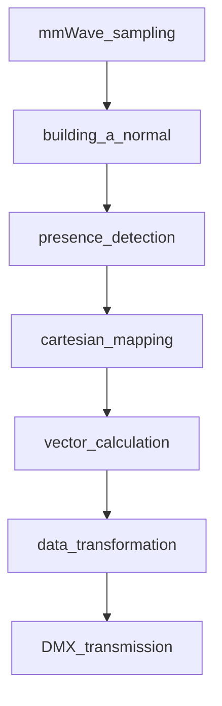

# Spot&shot

# Steps

## mmWave sampling

Using milimeter waves we sample distances using the principles of mmWave we build a pointcloud of the room. The principle is discussed in mroe detail [here](docs/mmWave/TheFundamentalsOfmmWaveRadarSensors.pdf)

## Building a normal

Using the point cloud we can construct a 'normal' a situation where nobody is present that can be used to differentiate to with other frames in the future.

## Presence detection

By first building a normal situation we can then detect anomalies. These should be our people present. Most likely we need to also filter out some noise.

## Carthesian mapping

Using the detected anomaly we need to place it inside our virtual space. It needs a point with a coordinate preferably aimed at the center of the person

## Vector calculation

Knowing the position of the anomaly and our spotlight we can calculate the vector that will be used to aim the spotlight

## Data transformation

This received vector needs to be translated to the right commands that will be used for transmission

## DMX transmission

Sending the data over DMX so our spotlight can do the right actions.
