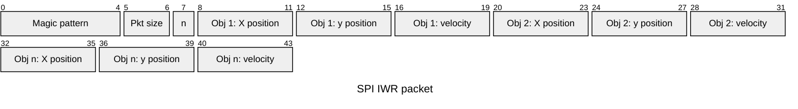

# IWR1642 to PICO

All calculations directly related to the tracking of objects is done on the IWR board as this board is specifically designed to handle these kinds of workloads. But handling everything might be too much for the IWR board. Therefor we decided to split workload between the IWR1642 BOOST and a raspberry pi Pico

For this to work a way to communicate must be decided on. 

## Spi communication

There is a need for a simple yet efficient data communication protocol. It doesn't have to travel far but speeds have to be rather high. SPI seems to be the best protocol for this use. Both boards have hardware support which will make the feature relatively easy to implement and understand.

## Data stream

Data is continuously sent over SPI from the IWR board. But because the Pico will not be using multiple cores nor make use of hardware offloading in the first version we will implement the stream in a more streamlined way.

The data stream from the IWR board remains continuous but it will include a magic pattern at the start of it's packet signaling the start of a new set of data. The Pico can then hook into this stream, listening for the magic pattern. Once it detects this pattern it can expect the next bytes to be structured a certain way and can parse properly.

After having taken a full packet it can then perform the necessary calculations that will convert the select a single object and point the spotlight at it.

After that is done it can hook back into the stream and start listening again.

## Data packets

Each packet follows a specific structure. Currently no error correction is implemented. Only basic information based error detection.

### Magic pattern

**5 Bytes**

04 05 08 01 02

This pattern should never be able to exist due to the nature of our floating points. and signals the start of a packet

### Header

**2 Bytes** Packet size in bytes, used for error checking

**1 Byte** Number of objects

### Payload

**Variable width**

The payload is a list of detected objects, depending on how many objects are detected the packet size changes. The number of objects in the header can be used to extract the right number of objects

### Single payload object

**4 bytes** X postition, looking from the sensor this would be doing from left to right (float)

**4 Bytes** Y position, looking from the sensor this would be the distance from the sensor (float)

**4 Bytes** In meters per second, how fast the object is moving in its current direction (float)

